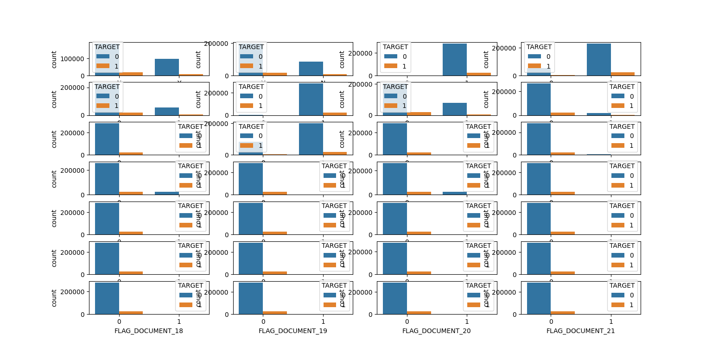

## EDA - Banking Analysis
- The provided code appears to be part of a data preprocessing and exploratory data analysis (EDA) pipeline for a machine learning project. It involves data import, cleaning, missing value imputation, feature engineering, and data visualization. Here's a breakdown of what each section of the code is doing:

### Imports and Basic Data Exploration:

 - Libraries like pandas, numpy, matplotlib, seaborn, and openpyxl are imported for data manipulation, analysis, visualization, and exporting data to Excel.
 - Data from the app and prev_app variables (presumably DataFrames) are imported from a module named src.config.
### Feature Selection and Missing Data Analysis:

 - Missing data in the app DataFrame is analyzed. The number of missing values for each column is calculated and sorted in ascending order.
Columns with missing value percentages greater than or equal to 40% are identified and stored in the msng_col list.
Columns starting with "FLAG" are identified and stored in the flag_col list.
 - A new DataFrame app_msng_rmvd is created by dropping columns with high missing value percentages from the app DataFrame.
 - A DataFrame flag_corr_df is created, containing columns related to flags and the 'TARGET' variable.
Correlation between flag-related columns and the 'TARGET' variable is computed and stored in corr_df.
### Data Processing for FLAGS:

 - Some binary flag columns are converted from 'N' and 'Y' to 0 and 1.
Irrelevant flag-related columns are dropped from the app_msng_rmvd DataFrame.
 - A DataFrame app_score_col_rmvd is created, containing flag-related columns and the 'TARGET' variable.
### Missing Value Imputation:

 - Missing values are imputed for columns like 'CNT_FAM_MEMBERS', 'OCCUPATION_TYPE', 'NAME_TYPE_SUITE', 'AMT_ANNUITY', and columns starting with "AMT_REQ_CREDIT_BUREAU."
### Feature Engineering:

 - Percentage of missing values in each column of app_score_col_rmvd is calculated and printed.
Some missing values are filled with specific values or imputed based on mean, median, or mode.
 - Additional data processing and feature engineering may be applied to other columns (not shown in the provided code).
Outlier Detection and Treatment:

 - Statistics (minimum, maximum, median) for the 'AMT_GOODS_PRICE' column are calculated and printed.
Kernel density and boxen plots are created to visualize the distribution of the 'AMT_GOODS_PRICE' column.
Binning of variables might have been attempted, but it appears to be commented out.
### Data Visualization:

 - Count plots for various flag-related columns with respect to the 'TARGET' variable are displayed.
Heatmaps showing correlations between columns are displayed.
Additional visualizations might have been generated but are not shown in the provided code.
### Data Processing for Previous Applications (prev_app):

 - Perform a similar analysis on another dataset (prev_app), calculating the percentage of missing values for each column and removing columns with a high percentage of missing values.
You also perform some data imputation for specific columns in prev_app.

### Results of data-processing
#### Fig.1 Missing data

#### Fig.2 Prev-app Missing data

#### Fig.3 Missing data example

#### Fig.4 Missing data example -> to 0

#### Fig.5 Missing data for amt_annuity and solve to 0

#### Fig.6 Set all missing data to 0

#### Fig.7 Outlier detection

#### Fig.8 Data analysis

#### Fig.9 Flags

#### Fig.10 AMT_Good_Price outlier treatment

#### Fig.11 Prev_data median mode mean

#### Fig.12 Prev_data graph

